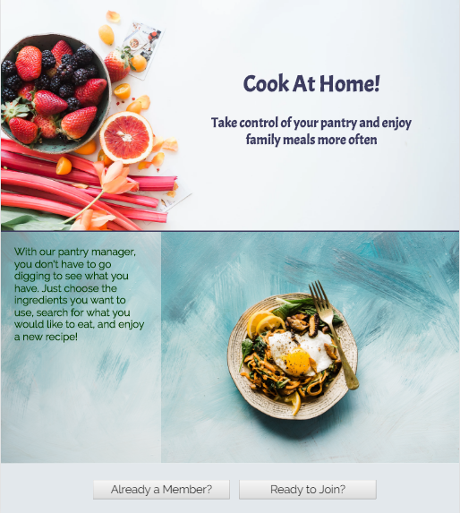
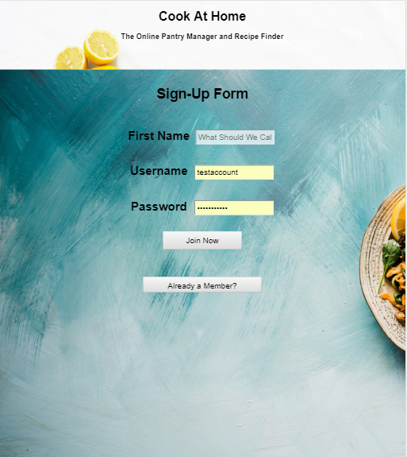
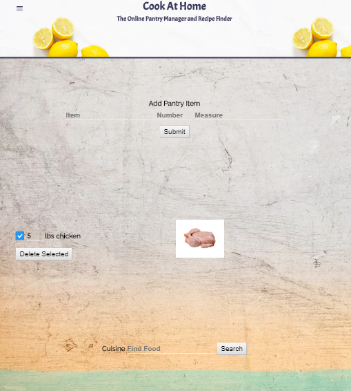
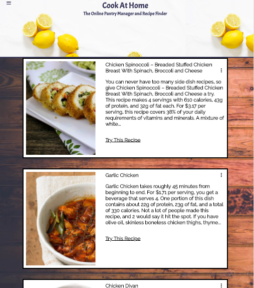

# Cook At Home 

[Try it here](https://agile-mountain-17088.herokuapp.com/index.html "Cook At Home")

I always like to try new recipes, but end up either having to buy new ingredients, or making the same things repeatedly.  This app was dreamt up to learn new recipes with items available in your pantry.

This page keeps track of all the items in your pantry, where you can edit the amount.  You can use the search bar to include other items or phrases, or click on the items in your pantry to search for them.

Searching for recipes will give you recipe cards with two sides of information.

## API Documentation
This app uses a simple Create, Read, Update, Delete (CRUD) API using JSON Web Authentication to manage the pantry.  The recipes come from the Spoonacular API (currently having issues where the recipes returned from the API search do not exist on the Spoonacular website. Trying to find another Recipe Search API.

## Tech Used

### Front End
The front end is built using HTML, CSS, Javascript, and jQuery.

### Back End
The database for this app is managed by Mongo and mLab

### Testing
This app is tested using Mocha, Chai, and Travis for continuous integration testing.

